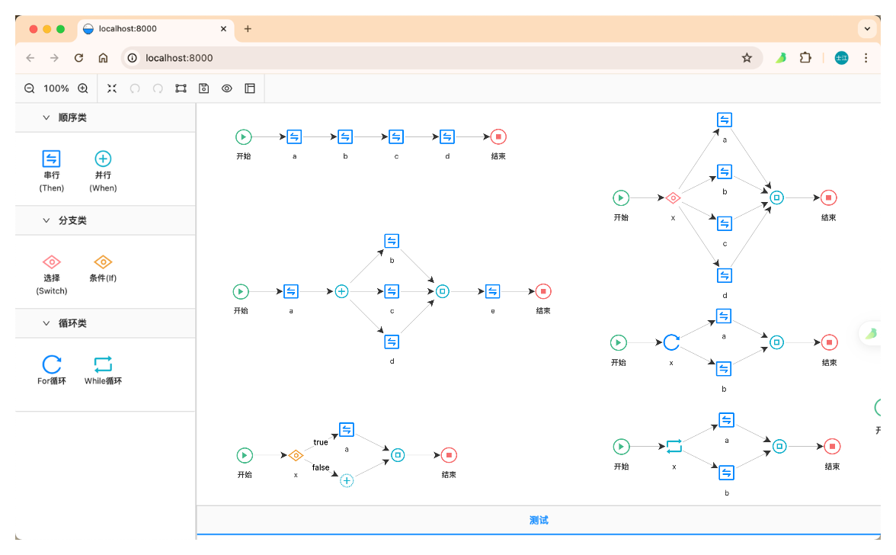

# LiteFlow逻辑可视化编排




## 自动布局相关资料

- 《浅谈图的层次布局》：https://mp.weixin.qq.com/s/68I6SXlrdMS84AqLm8daKQ
- 《深入解读Dagre布局算法》：https://www.yuque.com/antv/g6-blog/xxp5nl


## Getting Started

Install dependencies,

```bash
$ yarn
```

Start the dev server,

```bash
$ yarn start
```
